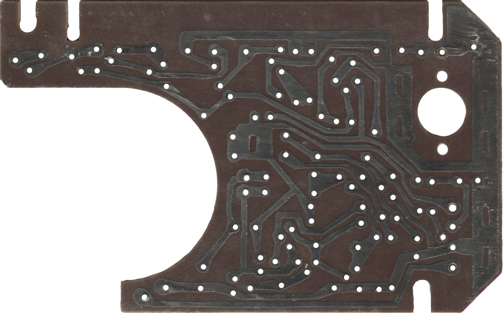

# Radio Konstruktors
 Radio construction kit from Latvian SSR circa 1987.

 There are [11 variations](/Projects/README.md) you can build. 
 The manual is in Russian, even though it has a Latvian title! 
 You can use the kit to practise your [(Russian) Morse Code](/MorseCode/README.md). 
 The PCB measures 124mm x 78mm. 

 

 

 

